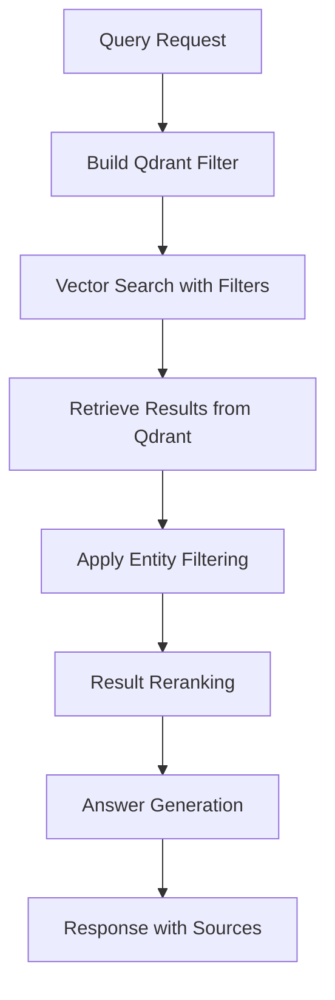

# Query Service

Production-ready query service for semantic search and question-answering that leverages OCR, NER, and embeddings to provide intelligent answers to user questions.

## Features

### Core Functionality
- **Semantic Search**: Find relevant documents using vector similarity and embeddings
- **Question Answering**: Extractive QA and RAG (Retrieval-Augmented Generation) modes
- **Advanced Filtering**: Multi-level filtering system with Postgres + Qdrant architecture
- **Entity Recognition**: Integration with NER for enhanced search capabilities
- **Result Reranking**: Improve relevance using cross-encoder models
- **Multiple LLM Support**: OpenAI, Anthropic, Mistral, and local models

### Query Modes

1. **Semantic Search** (`semantic_search`)
   - Find relevant documents using vector similarity
   - Supports advanced filtering and scoring
   - Returns ranked list of documents

2. **Extractive QA** (`extractive_qa`)
   - Extract exact answers from document text using entity-aware extraction
   - Best for factual questions with clear answers
   - Example: "Where is Dino based?" → "Split, Croatia"

3. **RAG** (`rag`)
   - Generate comprehensive answers using LLM + retrieved context
   - Better for complex questions requiring reasoning
   - Example: "What is Dino's technical expertise?" → Generated summary

## Architecture Overview

### Dual Database Architecture

The query service uses a sophisticated **dual-database architecture** for optimal performance and functionality:

#### **Postgres Database**
- **Purpose**: Document metadata storage and management
- **Contains**: File metadata, processing status, user information, timestamps
- **Role**: Master data store for document lifecycle management

#### **Qdrant Vector Database**
- **Purpose**: Vector similarity search and metadata filtering
- **Contains**: Document embeddings, searchable metadata, text chunks
- **Role**: High-performance semantic search with metadata filtering

### Two-Level Filtering System

The filtering system operates on **two levels** for maximum efficiency and flexibility:

#### **Level 1: Qdrant Vector Database Filtering (Primary)**
Filters are applied **during vector search** in Qdrant, reducing the search space before similarity calculation:

```python
# Example Qdrant filter construction
def _build_qdrant_filter(self, filter_params, tenant_id):
    conditions = []
    
    # Tenant isolation
    if tenant_id:
        conditions.append(FieldCondition(key="tenant_id", match=MatchValue(value=tenant_id)))
    
    # Metadata filtering
    if filter_params:
        for key, value in filter_params.items():
            if key == "content_type":
                conditions.append(FieldCondition(key="content_type", match=MatchValue(value=value)))
            elif key == "file_size_min":
                conditions.append(FieldCondition(key="file_size_bytes", range=Range(gte=value)))
            # ... more filters
    
    return Filter(must=conditions) if conditions else None
```

**Qdrant-Level Filters:**
- `tenant_id` - Multi-tenancy isolation
- `content_type` - MIME type filtering (e.g., "application/pdf", "image/jpeg")
- `file_type` - File category (image, text, document, other)
- `processing_status` - Only search completed documents
- `created_by` - User who uploaded the file
- `file_size_bytes` - File size ranges (min/max)
- `upload_timestamp` - Date range filtering

#### **Level 2: Post-Processing Entity Filtering (Secondary)**
Additional filtering applied **after vector search** using NER data:

```python
# Entity-based filtering on retrieved results
def filter_by_entities(self, results, entity_labels=None, entity_text=None):
    filtered_results = []
    
    for result in results:
        doc_entities = result.get("metadata", {}).get("ner_entities", [])
        
        # Check entity label filter
        if entity_labels:
            has_matching_label = any(
                any(entity.get("label") == label for entity in doc_entities)
                for label in entity_labels
            )
            if not has_matching_label:
                continue
        
        # Check entity text filter
        if entity_text:
            has_matching_text = any(
                any(entity.get("text", "").lower() == text.lower() for entity in doc_entities)
                for text in entity_text
            )
            if not has_matching_text:
                continue
        
        filtered_results.append(result)
    
    return filtered_results
```

**Post-Processing Entity Filters:**
- `entity_labels` - Filter by NER entity types (PERSON, ORG, GPE, etc.)
- `entity_text` - Filter by specific entity mentions

### Filter Processing Flow



1. **Request Processing**: Parse filter parameters and tenant ID
2. **Qdrant Filter Building**: Convert filters to Qdrant FieldConditions
3. **Vector Search**: Execute semantic search with metadata filters applied
4. **Entity Filtering**: Apply NER-based filtering to retrieved results
5. **Reranking**: Optional cross-encoder reranking for better relevance
6. **Answer Generation**: Extract or generate answers based on mode
7. **Response Formatting**: Return results with source attribution

## Filtering Capabilities

### Metadata Filters (Qdrant-Level)

| Filter | Type | Description | Example |
|--------|------|-------------|---------|
| `tenant_id` | String | Multi-tenant isolation | `"user123"` |
| `content_type` | String | MIME content type | `"application/pdf"` |
| `file_type` | String | File category | `"document"`, `"image"` |
| `processing_status` | String | Processing state | `"completed"` |
| `created_by` | String | Upload user | `"john.doe"` |
| `file_size_min` | Integer | Minimum file size (bytes) | `1000000` |
| `file_size_max` | Integer | Maximum file size (bytes) | `10000000` |
| `date_range` | Object | Upload date range | `{"start": "2024-01-01", "end": "2024-12-31"}` |

### Entity Filters (Post-Processing)

| Filter | Type | Description | Example |
|--------|------|-------------|---------|
| `entity_labels` | Array | NER entity types | `["PERSON", "ORG"]` |
| `entity_text` | Array | Specific entity mentions | `["Dino", "Macrometa"]` |

### Filter Examples

#### **Basic Multi-Tenant Filtering**
```json
{
  "question": "What programming languages does Dino know?",
  "filter": {
    "tenant_id": "user123",
    "file_type": "document",
    "processing_status": "completed"
  }
}
```

#### **Date Range and File Type Filtering**
```json
{
  "question": "Recent work experience",
  "filter": {
    "date_range": {
      "start": "2023-01-01T00:00:00Z",
      "end": "2024-01-01T00:00:00Z"
    },
    "content_type": "application/pdf"
  }
}
```

#### **Entity-Based Filtering**
```json
{
  "question": "Tell me about Dino",
  "filter": {
    "entity_labels": ["PERSON"],
    "entity_text": ["Dino"]
  }
}
```

#### **File Size and User Filtering**
```json
{
  "question": "Large documents about system design",
  "filter": {
    "file_size_min": 1000000,
    "file_size_max": 10000000,
    "created_by": "john.doe"
  }
}
```

## QA Endpoint Deep Dive

### How the QA Endpoint Works

The `/qa` endpoint is a sophisticated question-answering system that supports two main modes:

#### **Endpoint Overview**
- **URL**: `POST /qa`
- **Purpose**: Answer questions by finding relevant documents and extracting or generating answers
- **Modes**: `extractive_qa` (default) or `rag`

#### **Request Parameters**
```json
{
  "question": "What programming languages does Dino know?",
  "mode": "extractive_qa",  // or "rag"
  "top_k": 5,               // Number of documents to retrieve
  "filter": {               // Optional filtering
    "entity_labels": ["PERSON"],
    "tenant_id": "user123"
  },
  "max_context_length": 4000
}
```

#### **Step-by-Step Process**

1. **Semantic Search Phase**
   - Convert question to vector embedding
   - Apply Qdrant-level filters (tenant, metadata, etc.)
   - Search Qdrant vector database for similar document chunks
   - Retrieve top-k most relevant documents

2. **Entity Filtering Phase**
   - Apply post-processing entity filters if specified
   - Filter results based on NER entity labels and text

3. **Answer Generation Phase**
   - **Extractive QA Mode**: Extract exact answers using entity-aware extraction
   - **RAG Mode**: Generate comprehensive answers using LLM + retrieved context

#### **Answer Extraction Methods**

**Extractive QA - Entity-Aware Extraction:**
```python
def extract_answer_span(self, question, document_text, document_metadata):
    # Extract entities from question
    question_entities = self.extract_entities(question)
    
    # Get document entities from metadata
    doc_entities = document_metadata.get("ner_entities", [])
    
    # Try entity-aware extraction first
    if question_entities and doc_entities:
        answer, confidence = self._extract_entity_aware_answer(
            question, question_entities, document_text, doc_entities
        )
        if answer and confidence > 0.5:
            return answer, confidence
    
    # Fallback to keyword-based extraction
    return self._extract_keyword_based_answer(question, document_text)
```

This method:
1. **Extracts entities** from both the question and document
2. **Matches entities** between question and document
3. **Extracts contextual answers** based on entity types (PERSON, ORG, LOCATION, etc.)
4. **Falls back** to keyword-based extraction if entity matching fails

**RAG Mode - LLM-Generated Answers:**
```python
async def generate_rag_answer(self, question, context_documents, max_context_length):
    # Use LLM manager to generate comprehensive answer
    answer, confidence = await self.llm_manager.generate_rag_answer(
        question=question,
        context_documents=context_documents,
        max_context_length=max_context_length,
        temperature=0.7,
        max_tokens=1000
    )
    return answer, confidence
```

#### **Response Format**
```json
{
  "answer": "Dino knows Python, JavaScript, and Rust programming languages...",
  "confidence_score": 0.87,
  "sources": [
    {
      "document_id": "716f97c5-3a43-46b3-8a71-1b0ceafd0b33",
      "filename": "video-introduction-5.pdf",
      "quoted_text": "I'm Dino Lozina, and I'm based in Split, Croatia",
      "relevance_score": 0.92,
      "page_or_position": "Source 1"
    }
  ],
  "detected_entities": [
    {"text": "Dino Lozina", "label": "PERSON", "confidence": 0.75},
    {"text": "Split", "label": "GPE", "confidence": 0.85}
  ],
  "processing_time_ms": 245.6,
  "mode": "extractive_qa",
  "llm_provider": null,
  "llm_model": null
}
```

## Quick Start

### Prerequisites

- Python 3.12+
- PostgreSQL database
- Qdrant vector database
- spaCy English model: `python -m spacy download en_core_web_sm`
- **Mistral API Key** (get one at [Mistral AI Console](https://console.mistral.ai/))

### Installation

1. **Clone and setup**:
   ```bash
   cd backend/query-service
   pip install -e .
   ```

2. **Configure environment**:
   ```bash
   cp env.example .env
   # Edit .env with your settings
   ```

3. **Start the service**:
   ```bash
   uvicorn src.main:app --host 0.0.0.0 --port 8004
   ```

### Quick Docker Setup

```bash
# Navigate to backend directory
cd backend

# Set your Mistral API key
export MISTRAL_API_KEY=your_actual_mistral_api_key_here

# Start all services
docker-compose up --build
```

### Docker Setup

#### Method 1: Run with Main Docker Compose (Recommended)

```bash
# Navigate to backend directory
cd backend

# Set your Mistral API key
export MISTRAL_API_KEY=your_actual_mistral_api_key_here

# Start all services including query service
docker-compose up --build

# Or start just the query service and its dependencies
docker-compose up postgres qdrant query-service
```

#### Method 2: Run Query Service Standalone

```bash
# Navigate to query service directory
cd backend/query-service

# Set your Mistral API key
export MISTRAL_API_KEY=your_actual_mistral_api_key_here

# Run standalone (connects to existing services)
docker-compose up --build
```

#### Method 3: Using .env File

Create a `.env` file in the `backend` directory:

```bash
cd backend
echo "MISTRAL_API_KEY=your_actual_mistral_api_key_here" > .env
docker-compose up --build
```

**Important**: Never commit your API key to version control! The `.env` file is already in `.gitignore`.

## API Endpoints

### Main Query Endpoint

```http
POST /query
Content-Type: application/json
X-Tenant-ID: your-tenant-id

{
  "query": "What programming languages does Dino know?",
  "mode": "rag",
  "top_k": 5,
  "score_threshold": 0.7,
  "filter": {
    "tenant_id": "dino",
    "entity_labels": ["PERSON", "ORG"],
    "date_range": {
      "start": "2024-01-01T00:00:00Z",
      "end": "2024-12-31T23:59:59Z"
    }
  }
}
```

### Semantic Search

```http
POST /search
Content-Type: application/json

{
  "query": "Python programming",
  "top_k": 10,
  "score_threshold": 0.7,
  "filter": {
    "file_type": "pdf",
    "processing_status": "completed"
  }
}
```

### Question Answering

```http
POST /qa
Content-Type: application/json

{
  "question": "What is Dino's leadership style?",
  "mode": "extractive_qa",
  "top_k": 5,
  "max_context_length": 2000,
  "filter": {
    "entity_labels": ["PERSON"],
    "file_type": "document"
  }
}
```

### Health Check

```http
GET /health
```

## Configuration

### Environment Variables

| Variable | Description | Default |
|----------|-------------|---------|
| `EMBEDDING_MODEL` | Sentence transformer model | `sentence-transformers/all-MiniLM-L6-v2` |
| `QDRANT_HOST` | Qdrant host | `localhost` |
| `QDRANT_PORT` | Qdrant port | `6333` |
| `DATABASE_URL` | PostgreSQL connection string | Required |
| `LLM_PROVIDER` | LLM provider (openai/anthropic/mistral) | `openai` |
| `OPENAI_API_KEY` | OpenAI API key | Required for OpenAI |
| `ANTHROPIC_API_KEY` | Anthropic API key | Required for Anthropic |
| `ENABLE_RERANKING` | Enable result reranking | `true` |

### LLM Configuration

#### OpenAI
```env
LLM_PROVIDER=openai
OPENAI_API_KEY=your_api_key
OPENAI_MODEL=gpt-3.5-turbo
```

#### Anthropic
```env
LLM_PROVIDER=anthropic
ANTHROPIC_API_KEY=your_api_key
ANTHROPIC_MODEL=claude-3-sonnet-20240229
```

#### Mistral
```env
LLM_PROVIDER=mistral
MISTRAL_API_KEY=your_api_key
MISTRAL_MODEL=mistral-small
```

## Development

### Running Tests

```bash
# Run all tests
pytest

# Run with coverage
pytest --cov=src --cov-report=html

# Run specific test file
pytest tests/test_api.py
```

### Code Quality

```bash
# Format code
black src/ tests/

# Lint code
flake8 src/ tests/

# Type checking
mypy src/
```

## Architecture Details

### Components

1. **QueryProcessor**: Core processing logic
   - Semantic search with Qdrant
   - Entity extraction with spaCy
   - Answer generation (extractive + RAG)
   - Result reranking
   - Multi-level filtering

2. **FastAPI Application**: REST API endpoints
   - `/query` - Main query endpoint
   - `/search` - Semantic search
   - `/qa` - Question answering
   - `/health` - Health check

3. **Models**: Pydantic models for request/response validation

4. **Utils**: Utility functions for text processing and validation

### Data Flow

1. **Query Input** → Validation → Embedding Generation
2. **Qdrant Filter Building** → Metadata filtering conditions
3. **Vector Search** → Qdrant with filters applied
4. **Entity Filtering** → NER-based post-processing filtering
5. **Reranking** → Cross-encoder model (optional)
6. **Answer Generation** → Extractive QA or RAG
7. **Response** → Formatted results with sources

### Why This Architecture?

1. **Performance**: Qdrant filtering happens at the vector level, reducing search space before similarity calculation
2. **Scalability**: Vector databases are optimized for metadata filtering + similarity search
3. **Flexibility**: Postgres stores detailed metadata, Qdrant stores searchable metadata
4. **Multi-tenancy**: Tenant isolation happens at the vector search level
5. **Entity Intelligence**: NER-based filtering adds semantic understanding

## Performance

### Optimization Tips

- Use appropriate `top_k` values (5-10 for QA, 10-20 for search)
- Enable reranking for better relevance
- Use filters to narrow search scope
- Cache frequent queries with Redis
- Monitor processing times and confidence scores

### Monitoring

- Health check endpoint for service status
- Processing time metrics
- Confidence score tracking
- Query volume and patterns

## Troubleshooting

### Common Issues

1. **spaCy model not found**
   ```bash
   python -m spacy download en_core_web_sm
   ```

2. **Qdrant connection failed**
   - Check Qdrant is running
   - Verify host/port settings
   - Check collection exists

3. **Database connection failed**
   - Verify PostgreSQL is running
   - Check connection string
   - Ensure database exists

4. **LLM API errors**
   - Verify API keys are set
   - Check rate limits
   - Verify model names

5. **Filtering not working**
   - Check filter parameter names match exactly
   - Verify metadata exists in Qdrant payload
   - Check tenant_id is properly set

### Logs

Check logs for detailed error information:
```bash
# Docker logs
docker-compose logs query-service

# Local logs
tail -f logs/query-service.log
```

## License

MIT License - see LICENSE file for details.